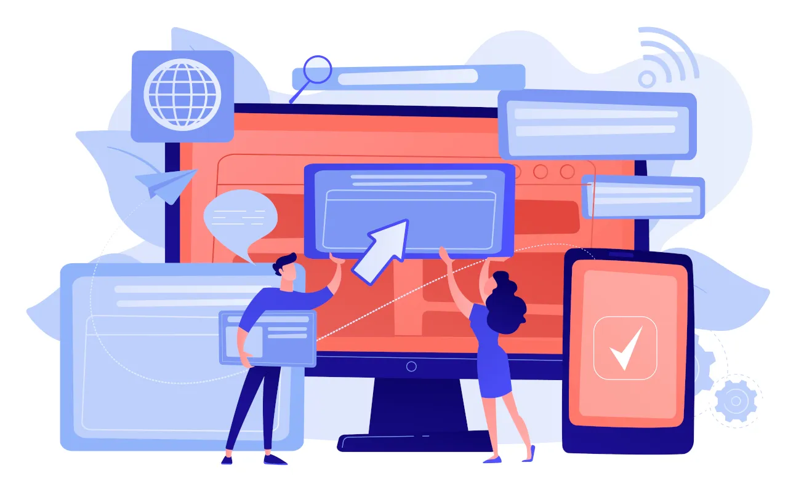
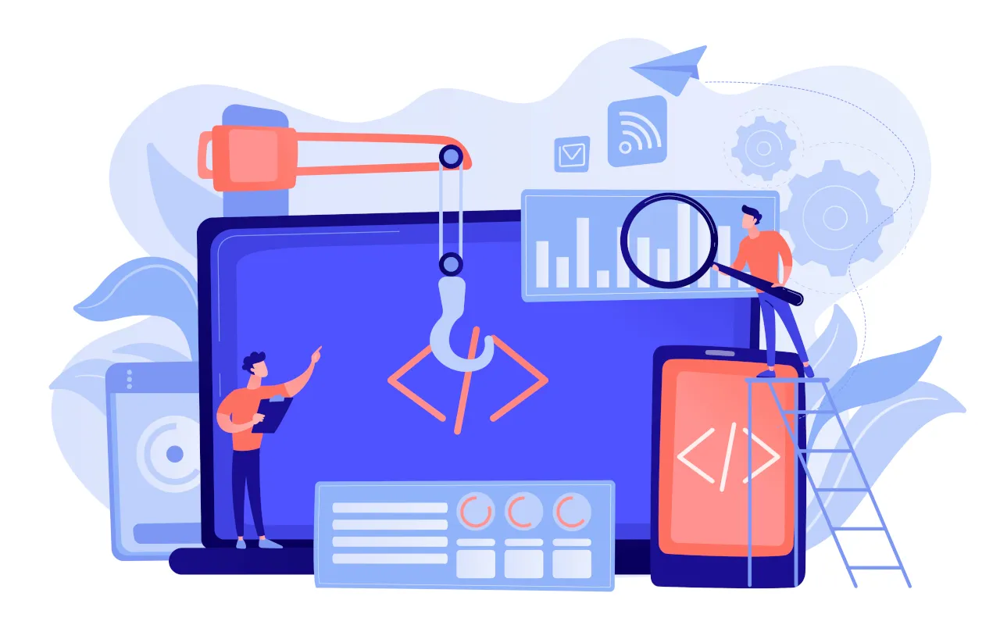
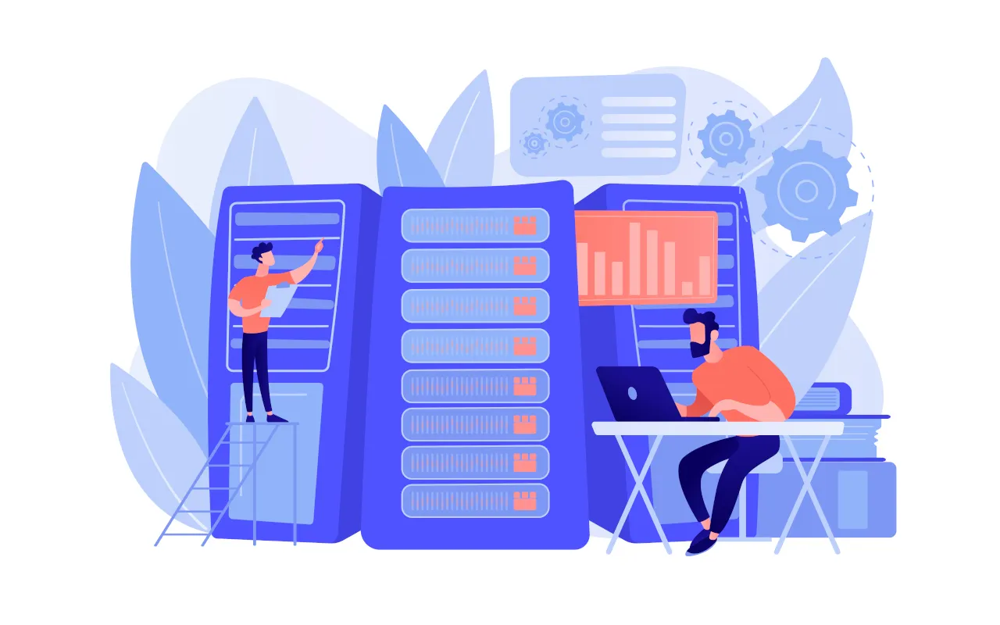
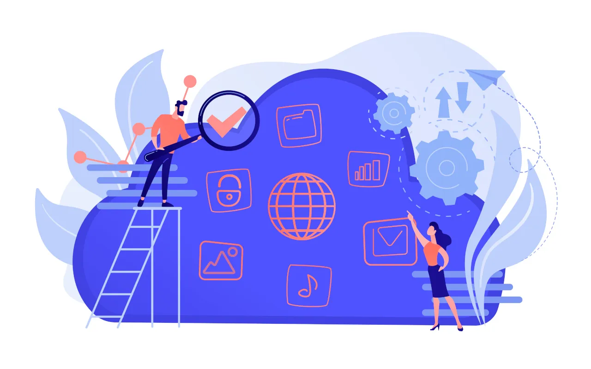

[owl-carousel margin=100 center=true stagePadding=100 loop=true autoplay=false nav=true responsive={0:{items:1,stagePadding:25},640:{items:1,stagePadding:100},960:{items:2,stagePadding:50},1280:{items:2,stagePadding:100}}][div style="height: 750px"]

### Website
Benötigen Sie eine Website für Ihren Verein, Startup oder für einen persönlichen Zweck?  
Wir erstellen günstig eine moderne Website für Sie, die Ihren Wünschen entspricht. Auf Wunsch finden wir eine passende Domain und verwalten Ihr gesamtes Hosting & E-Mail für Sie.
- professionelle Website
- responsive Design
- optimiertes SEO
- Domain, Hosting & Email

[Mehr erfahren](/dienstleistungen/website?classes=btn,btn-secondary,btn-lg)
[/div]
[div style="height: 750px"]

### Applikation
Benötigen Sie eine eigene Applikation für Ihre Firma, die all Ihren Wünschen entspricht?  
Wir erstellen für Sie eine moderne Applikation, die für Ihr Anliegen personalisiert ist und Ihren Wünschen entspricht. Diese kann für Smartphones, Desktopgeräte und/ oder webbasiert sein.
- moderne Applikation
- einfach zu bedienen
- einfach erweiterbar
- sichere Daten

[Mehr erfahren](/dienstleistungen/applikation?classes=btn,btn-secondary,btn-lg)
[/div]
[div style="height: 750px"]

### Datenbank
Benötigen Sie eine neue Datenbank oder möchten Sie in eine bestehende migrieren?  
Wir können für Sie eine Datenbank nach Ihren Wünschen erstellen oder eine bestehende zu einem anderen System migrieren. Dabei kann es sich um eine SQL oder NoSQL DB handeln.
- Datenbanksystem
- überlegte Struktur
- einfach zu verwalten
- schnelle Abfragen

[Mehr erfahren](/dienstleistungen/datenbank?classes=btn,btn-secondary,btn-lg)
[/div]
[div style="height: 750px"]

### Support
Benötigen Sie eine andere IT Dienstleistung oder haben Sie eine Frage zur IT?  
Wir bieten Ihnen auch andere IT Dienstleistungen an oder beantworte Ihre Fragen zum Thema IT. Die Möglichkeiten sind dabei unbegrenzt. Kontaktieren Sie uns und wir finden eine Lösung für Sie.

[Mehr erfahren](/dienstleistungen/support?classes=btn,btn-secondary,btn-lg)
[/div]
[/owl-carousel]
