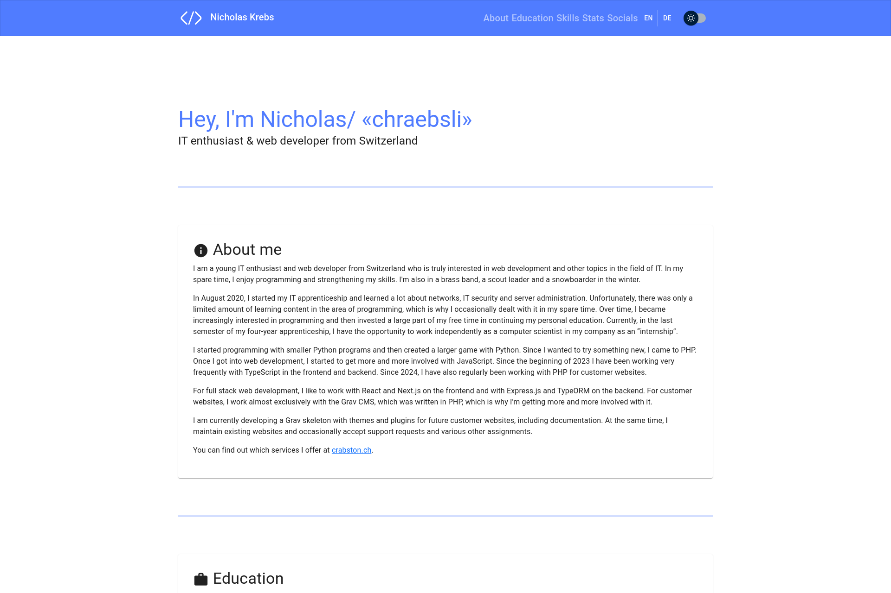
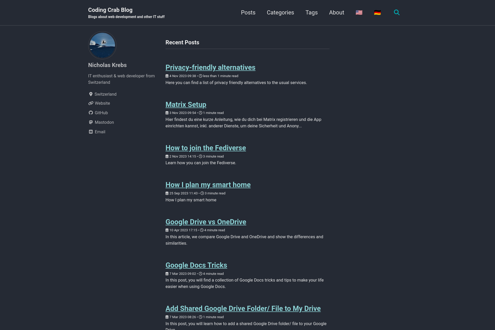
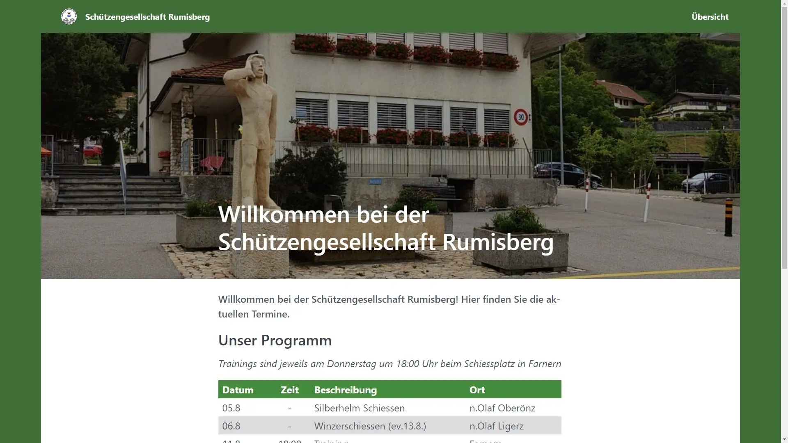
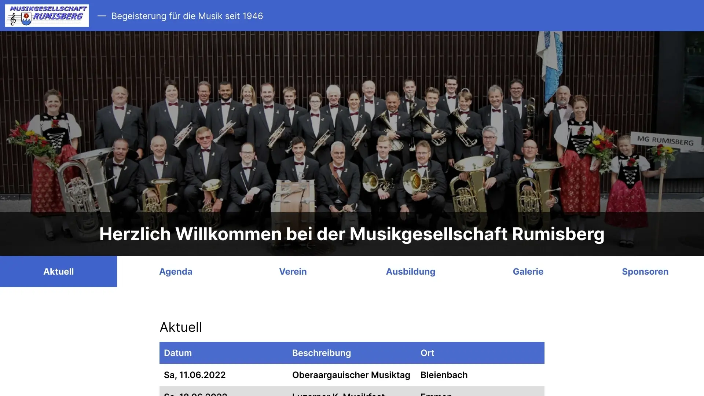
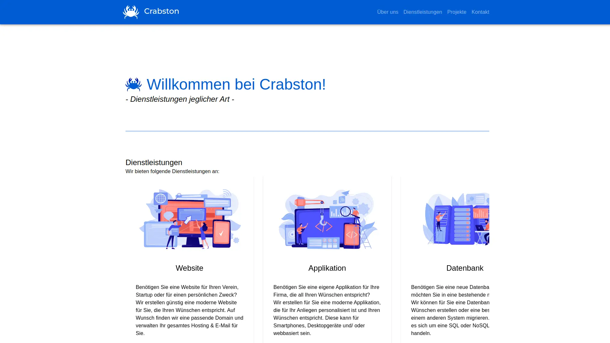
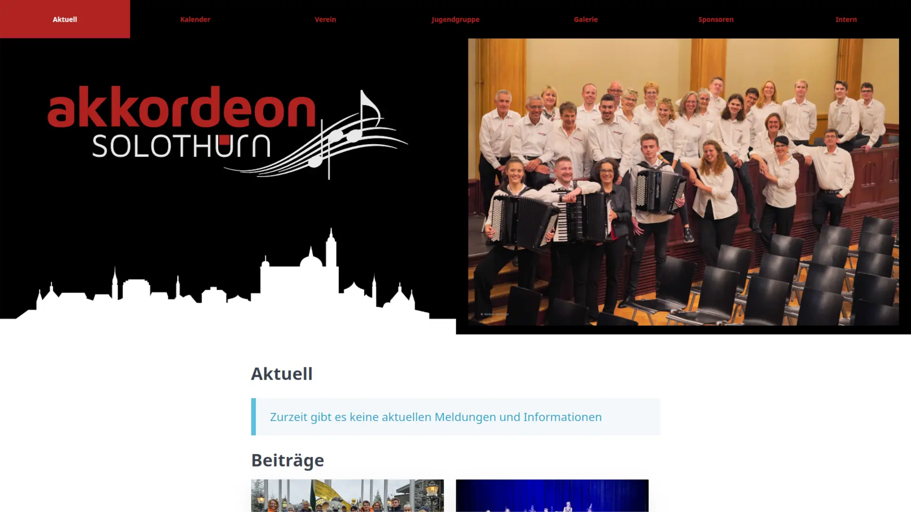

[owl-carousel margin=100 center=true stagePadding=100 loop=true autoplay=true nav=true responsive={0:{items:1,stagePadding:25},640:{items:1,stagePadding:100},960:{items:2,stagePadding:50},1280:{items:2,stagePadding:100}}][div class="owl-item-container"]

### Portfolio
[span class="chip"]Veröffentlicht[/span] [span class="chip"]Persönlich[/span] [span class="chip"]Website[/span]  
Diese Website ist das persönliche Portfolio von Nicholas Krebs. Im Juni 2023 wurde diese von Grund auf überarbeitet und basiert nun auf den neuesten Technologien.  
[Mehr erfahren](/projekte/portfolio?classes=btn,btn-secondary,btn-lg)
[/div]

[div class="owl-item-container"]

### Coding Crab Blog
[span class="chip"]Veröffentlicht[/span] [span class="chip"]Persönlich[/span] [span class="chip"]Website[/span]  
Der Coding Crab Blog ist der persönliche Blog von Nicholas, auf dem er Beiträge und Anleitungen im Bereich der Informatik teilt. Der Blog wurde aus einer Vorlage erstellt.  
[Mehr erfahren](/projekte/coding-crab-blog?classes=btn,btn-secondary,btn-lg)
[/div]

[div class="owl-item-container"]

### Schützengesellschaft Rumisberg
[span class="chip"]Veröffentlicht[/span] [span class="chip"]Kunde[/span] [span class="chip"]Website[/span]  
Die Website der Schützengesellschaft Rumisberg war der erste private Auftrag eines Gründungsmitglieds von Crabston GmbH. Sie wollten eine neue Website für ihren Verein.  
[Mehr erfahren](/projekte/sgrumisberg?classes=btn,btn-secondary,btn-lg)
[/div]

[div class="owl-item-container"]

### Musikgesellschaft Rumisberg
[span class="chip"]Veröffentlicht[/span] [span class="chip"]Kunde[/span] [span class="chip"]Website[/span]  
Ein weiteres Projekt eines Gründungsmitglieds von Crabston war die Website der Musikgesellschaft Rumisberg. Als Mitglied übernahm er die Erstellung einer neuen Website.  
[Mehr erfahren](/projekte/mgrumisberg?classes=btn,btn-secondary,btn-lg)
[/div]

[div class="owl-item-container"]

### Crabston GmbH
[span class="chip"]Veröffentlicht[/span] [span class="chip"]Geschäftlich[/span] [span class="chip"]Website[/span]  
Dies ist die Geschäftswebsite von Crabston GmbH, die Website, auf der Sie sich gerade befinden. Sie wurde im Februar 2024 aus einer Website eines Mitarbeiters erstellt.  
[Mehr erfahren](/projekte/crabston?classes=btn,btn-secondary,btn-lg)
[/div]

[div class="owl-item-container"]

### Akkordeon Solothurn
[span class="chip"]Veröffentlicht[/span] [span class="chip"]Kunde[/span] [span class="chip"]Website[/span]  
Dies ist die Geschäftswebsite von Akkordeon Solothurn, die Website, auf der Sie sich gerade befinden. Sie wurde im Februar 2024 aus einer Website eines Mitarbeiters erstellt.  
[Mehr erfahren](/projekte/akkordeon-solothurn?classes=btn,btn-secondary,btn-lg)
[/div]
[/owl-carousel]
