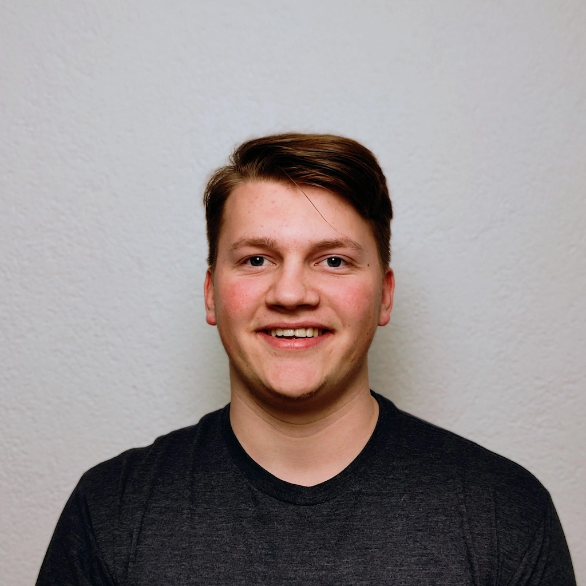
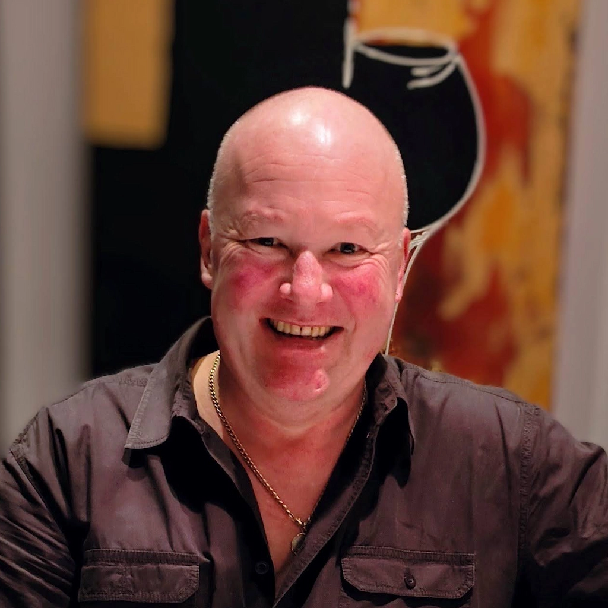

# Über uns

## Firma
Crabston GmbH ist eine junge Schweizer Firma, die Anfang 2024 als Familienunternehmen gegründet wurde. Wir konzentrieren uns primär auf die IT, bieten aber auch andere Dienstleistungen ausserhalb der IT an, wie zum Beispiel Immobilien. Unser Sitz befindet sich im historischen Städtli in Wangen an der Aare.

Neben einem breiten Spektrum an allgemeinen Informatikdienstleistungen bieten wir auch individuelle IT Lösungen für unsere Kunden an. Dabei haben wir uns auf die Erstellung von Websites mit [Grav CMS](https://getgrav.org/) und Webshops mit [Snipcart](https://snipcart.com/) spezialisiert, wofür wir unser eigenes Theme «[Hadron](https://usehadron.dev/?utm_source=crabston.ch&utm_medium=portfolio)» entwickeln sowie einige nützliche Plugins für Grav. Dank Grav und unserer Anpassungen kann jeder eine Website betreuen und bearbeiten, selbst wenn man bisher noch keine Erfahrung mit Websites hat. Und auch für erfahrene Nutzer ist es ein positives Erlebnis, anders als man dies von einigen anderen Systemen kennt.

Alle unsere Dienstleistungen sind für unsere Kunden individualisiert, um ihren Bedürfnissen zu entsprechen, nicht unseren. Dabei setzen wir auf aktuelle Tools & Technologien, um die bestmögliche Unterstützung zu bieten.

Die Zufriedenheit unserer Kunden steht für uns an erster Stelle. Wir setzen alles daran, unsere Kunden mit unserem Service und unseren Produkten zu begeistern.

Unser Büro finden Sie unter folgender Adresse:  
Crabston GmbH  
Städtli 16  
3380 Wangen an der Aare  
[kontakt@crabston.ch](mailto:kontakt@crabston.ch)

UID: CHE-183.413.699

## Wer sind wir
Lerne uns kennen:

[columns][center]
[figure class="avatar"][/figure]
### Nicholas Krebs
**IT Spezialist**  
[/center]
«Ich bin der IT Verantwortliche: Ich erstelle die Websites, mache den Support und helfe bei weiteren IT Anliegen. Meine Ausbildung habe ich im Sommer 2024 als Informatiker EFZ abgeschlossen. Bereits während meiner breiten Ausbildung in den Bereichen Betrieb, Netzwerk und Security habe ich mir das Programmieren selbst beigebracht und eigene Projekte realisiert.»

[center]
[figure class="avatar"][/figure]
### Ronald Krebs
**Berater & Immobilien**  
[/center]
«Ich bin Berater und bin für unsere weiteren Dienstleistungen und Immobilien zuständig. Ursprünglich habe ich den Beruf des Bildhauers erlernt und ausgeübt. Seither habe ich diverse Firmen gegründet. Mittlerweile leite ich seit vielen Jahren primär die Bargetzi Grabmalkunst GmbH.»
[/columns]

## Standort
[iframe width="100%" height="600" url="https://www.google.com/maps/embed?pb=!1m18!1m12!1m3!1d2709.0126923332964!2d7.652396377101254!3d47.235897613501805!2m3!1f0!2f0!3f0!3m2!1i1024!2i768!4f13.1!3m3!1m2!1s0x4791d5000e21006b%3A0xdf42a03b9f8ed076!2sCrabston%20GmbH!5e0!3m2!1sde!2sch!4v1713435587063!5m2!1sde!2sch" /]
